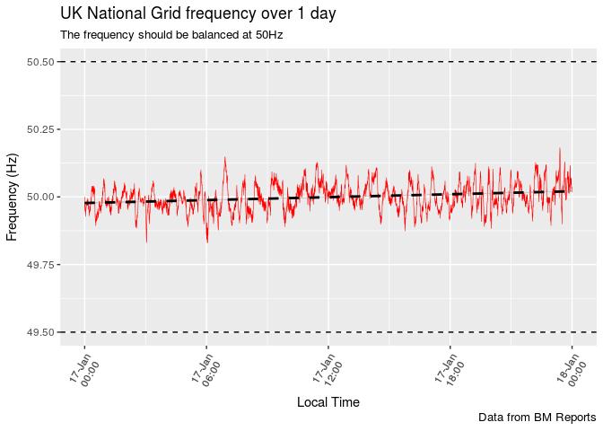
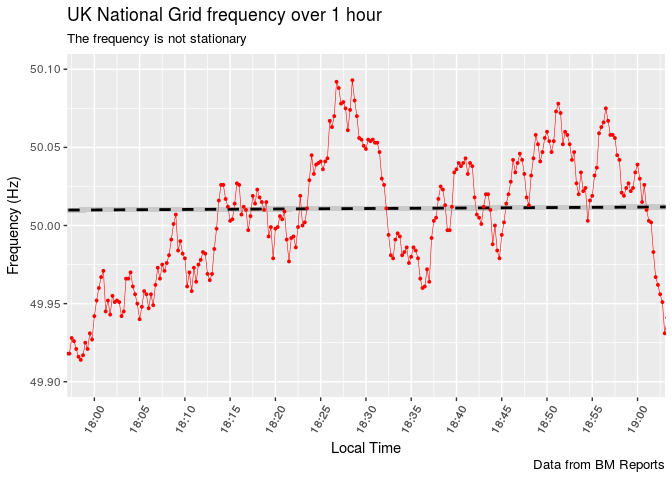
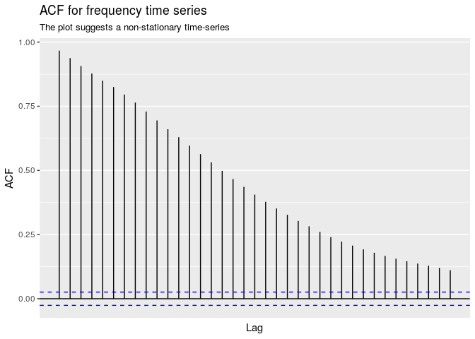
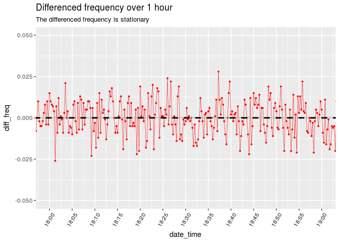
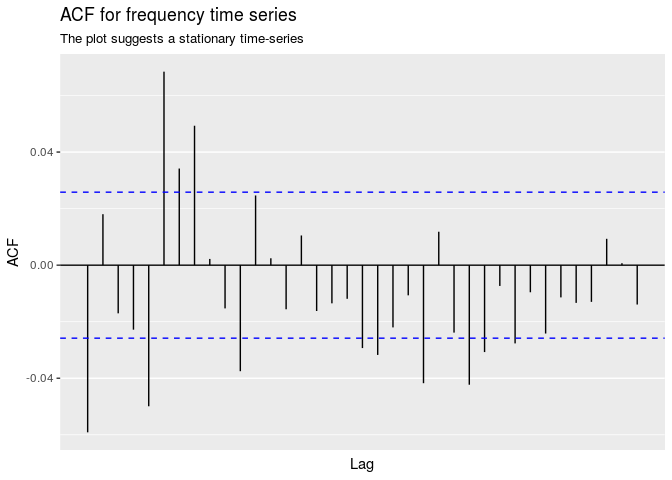

BM Report Analysis
================
2017-02-13

Introduction
============

The purpose of this report is to study and analyse the data available from the BM (Balancing Mechanism) reports. These reports contain current and historical data relating to the supply of electricity on the UK national grid. The reports include data relating to transmission, generation, demand and balancing. We access the data using an API (Application Programming Interface) which is described in detail [(Ghanty 2016)](https://www.elexon.co.uk/wp-content/uploads/2016/10/Application-Programming-Interfaces-API-and-Data-Push-user-guide.pdf) and is available on the Elexon website .

Herein, we will show how the R programming language can be used to analyse and acquire knowledge from the data; we will perform the analysis in a reproducible fashion. Specifically, we will demonstrate the `tidyverse` style of R programming, as described by [(Wickham and Grolemund 2017)](http://r4ds.had.co.nz/). The `tidyverse` is a set of packages (groups of functions) that are highly consistent in style and interface. When tools all work in the same way, it is much easier to use them and understand them. The `tidyverse` tools include functions for reading, tidying, iterating, plotting and processing data.

In addition to demonstrating the `tidyverse`, we will demonstrate analysis techniques which are appropriate to developing predictive and forecasting models for time-series, which are presented in [(Hyndman and Athanasopoulos 2014)](https://www.otexts.org/fpp).

Basic Data Aqusition
====================

Reading the Data
----------------

As discussed above, we use an API to access the BM Report data. This requires a key which is available upon registration with Elexon. The code below requires each user to enter their unique API key. If you run this code, you will be prompted to enter your personal key. The method for connecting to the API is described in Ghanty (2016) pp. 12-13.

In this example, we will acquire the 'Rolling System Frequency' on the 17th of January, 2017. Accessing this particular data is described in Ghanty (2016) p. 81. We use the `urltools` package to encode the API URL (Universal Resource Locator) given the query. In this case, we request the data in XML (Extensible Markup Language) format.

``` r
# get API key from user  -------------------------------------------------------
api_key <- getPass("Enter API key")
stopifnot(!is.null(api_key))

# API query data 
report_type <- "BMRS/FREQ"             # name of report to request from API
start_datetime <- "2017-01-17 00:00:00"
end_datetime <- "2017-01-18 00:00:00"

# construct query API URL ------------------------------------------------------
service_url <- paste(
    "https://api.bmreports.com:443",
    report_type,
    "v1",
    sep = "/")

query_url <- service_url %>% 
    param_set("APIKey", api_key) %>% 
    param_set("FromDateTime", url_encode(start_datetime)) %>% 
    param_set("ToDateTime", url_encode(end_datetime)) %>% 
    param_set("ServiceType", "xml")  

# connect to API and request data ---------------------------------------------
print(paste0("[", Sys.time(), "] Connected to BM Reports API ..."))
```

    ## [1] "[2017-02-10 10:40:02] Connected to BM Reports API ..."

``` r
xmlfile <- read_xml(query_url)

# tidy up sensitive information -----------------------------------------------
rm(api_key,  query_url)
```

To prevent unnecessary connections to the API, the results of the code above are cached. Care should be taken in general to be 'polite', only connecting to the API when really necessary. API providers, including Elexon, set out rules defining what acceptable usage means.

Extracting Data
---------------

The `xml2` package is used to parse and process the data. Note that HTTP (Hyper Text Transfer Protocol) status code for 'OK' is 200 so we first check that data was retrieved from the API without error. Next, we extract the relevant data. The XML nodes are selected using the XPath language, which is described in W3Schools (2017) (see [here](http://www.w3schools.com/xml/xpath_intro.asp)).

``` r
# check succsess - http code must be 200 --------------------------------------
status <- xmlfile %>% 
    xml_find_first("responseMetadata/httpCode") %>% 
    xml_text()
stopifnot(status == 200)

# extract raw data from XML document and save ---------------------------------
data_xpaths <- list(
    date = "//reportSnapshotTime", 
    time = "//spotTime", 
    freq = "//frequency"
)

df_raw <- data_xpaths %>% 
    map_df(~ xmlfile %>%  xml_find_all(.x) %>%  xml_text())

saveRDS(df_raw, "df_raw.rds")
```

The raw data from the XML file requires some tidying. Here, we are using the `dplyr` package (a part of the `tidyverse`) to manipulate the raw data. The `lubridate` package is used to work with time-based data. In our experience, great care must be taken with time stamped data. Be aware of local time zones, local time formatting, daylight saving hours, leap years, leap minutes, etc. The `lubridate` package takes care of this detail. We simply tell `lubridate` to work in 'London' time.

``` r
df_tidy <- df_raw %>% 
    mutate(
        date_time = ymd_hms(paste(date, time), tz = "Europe/London"),
        freq = as.numeric(freq)) %>% 
    select(date_time, freq, -c(date, time))   
    
knitr::kable(
  head(df_tidy), 
  caption = "Data retrieved from BM reports API"
)
```

| date\_time          |    freq|
|:--------------------|-------:|
| 2017-01-17 00:00:00 |  50.000|
| 2017-01-17 00:00:15 |  49.962|
| 2017-01-17 00:00:30 |  49.966|
| 2017-01-17 00:00:45 |  49.949|
| 2017-01-17 00:01:00 |  49.964|
| 2017-01-17 00:01:15 |  49.954|

Plotting Data
-------------

Finally, we use the `ggplot` package (also part of the `tidyverse`) to produce a variety of intuitive plots.

### Time series

A time series line plot gives some insight into:

-   Overall patterns: trend, seasonality, cyclic components.

-   Levels and variance.

-   Whether the data is stationary.

-   Anomalies, outliers, errors, etc.

``` r
my_breaks <- seq(from = ymd_hms(start_datetime), to = ymd_hms(end_datetime),  
                 by = "6 hours")

# time series plot ------------------------------------------------------------
plt_line <- ggplot(df_tidy, aes(date_time, freq, group = 1)) +
    geom_line(colour = 'red', size = 0.2) +
    labs(title = "UK National Grid frequency over 1 day", 
         subtitle = "The frequency should be balanced at 50Hz",
         caption = "Data from BM Reports",
         x = "Local Time",
         y = "Frequency (Hz)") +
    geom_smooth(method = "lm", linetype = "dashed", colour = "black") + 
    geom_hline(yintercept = c(1.01 * 50, 0.99 * 50), 
               linetype = "dashed", colour = "black", size = 0.5) +
    scale_x_datetime(
        breaks = my_breaks,
        date_labels = "%d-%b\n%H:%M"
    ) + 
    theme(axis.text.x = element_text(angle = 60, vjust = 0.5))

plt_line
```



The National Grid have an [obligation](http://www2.nationalgrid.com/uk/services/balancing-services/frequency-response/) to control the frequency within ± 1% of the nominal value of 50Hz. We have fitted a line using a linear model with gradient and intercept which is displayed with a bold black dashed line. We have also fitted 50 ± 0.5Hz reference lines. We observe a small upwards trend but the frequency is well within obligations.

### Stationary Data

This data has a resolution of 15 seconds so it is interesting to 'zoom in' and to observe a smaller time window.

``` r
my_xlims <- ymd_hms(c("2017-01-17 18:00:00", "2017-01-17 19:00:00"))
my_breaks <- seq(from = my_xlims[1], my_xlims[2], by = "5 mins")

plt_line + 
    coord_cartesian(xlim = my_xlims, ylim = 50 + c(0.1, -0.1)) + 
    geom_point(color = 'red', size = 0.7) +
    scale_x_datetime(
        breaks = my_breaks,
        date_labels = "%H:%M"
    ) +
    labs(
        title = "UK National Grid frequency over 1 hour",
        subtitle = "The frequency is not stationary"
    )
```

    ## Scale for 'x' is already present. Adding another scale for 'x', which
    ## will replace the existing scale.



An important class of modelling for time series data is known as ARIMA (Auto-regressive Integrated Moving Average) (Hyndman and Athanasopoulos 2014, sec. 8.1). In order to use this model, we need to understand the concept of "stationary" data. Formally, if *y*<sub>*t*</sub> is a stationary time series, then for all *s*, the distribution of (*y*<sub>*t*</sub>,…,*y*<sub>*t* + *s*</sub>) does not depend on *t*. A less formal description of stationary data is data which looks the same wherever you observe it. There should be no trending or seasonality; the data should look like white noise.

When the frequency data is observed in a one hour time window, trending behavior is observed. The slowly decaying ACF (Auto-correlation Function) provides further evidence. Note that the ACF plot if for the *whole* data set.

``` r
ggAcf(df_tidy$freq) +
    labs(
        title = "ACF for frequency time series",
        subtitle = "The plot suggests a non-stationary time-series"
    )
```



### Differences

A common approach to making data stationary is to apply differencing. This means to model differences in data rather than the original data. For example, consider the plots of differences in the frequency time-series.

``` r
# note that to use time series tools, it seems better to work with
# data as time series. Below, we run the diff on a time series, convert back
# to a data frame and joing it
ts_tidy <- xts::xts(df_tidy$freq, df_tidy$date_time)

df_tidy <- df_tidy %>% left_join(
    diff(ts_tidy) %>% 
        broom::tidy() %>% 
        select(date_time = index, diff_freq = value)
)
```

    ## Joining, by = "date_time"

``` r
ggplot(remove_missing(df_tidy), aes(date_time, diff_freq)) +
    geom_line(colour = 'red', size = 0.2) +
    geom_point(color = 'red', size = 0.7) +
    coord_cartesian(xlim = my_xlims, ylim = 0.05 * c(-1, 1)) + 
    scale_x_datetime(
        breaks = my_breaks,
        date_labels = "%H:%M"
    ) +
    labs(
        title = "Differenced frequency over 1 hour",
        subtitle = "The differenced frequency is stationary"
    ) +
    geom_smooth(method = "lm", linetype = "dashed", colour = "black") + 
    theme(axis.text.x = element_text(angle = 60, vjust = 0.5))
```

    ## Warning: Removed 1 rows containing missing values.



``` r
ggAcf(df_tidy$diff_freq) +
    labs(
        title = "ACF for frequency time series",
        subtitle = "The plot suggests a stationary time-series"
    )
```



References
==========

Ghanty, Zaahir. 2016. *BMRS Api and Data Push User Guide*. Elexon.

Hyndman, Rob J., and George Athanasopoulos. 2014. *Forecasting: Principles and Practice*. OTexts.

W3Schools. 2017. “XPath Tutorial.” <http://www.w3schools.com/xml/xpath_intro.asp>.

Wickham, Hadley, and Garrett Grolemund. 2017. *R for Data Science: Import, Tidy, Transform, Visualize, and Model Data*. 1st ed. Paperback; O’Reilly Media.
