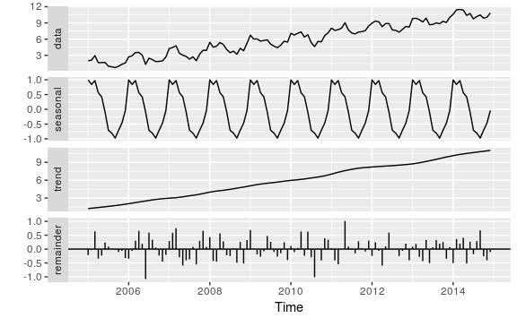
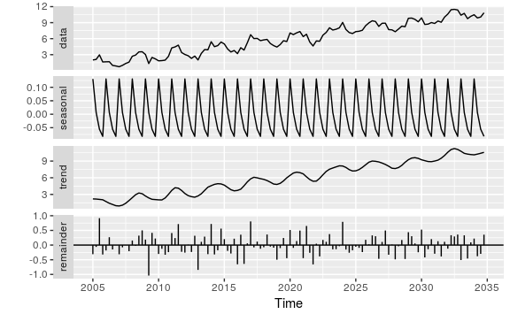
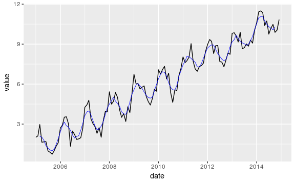

Understanding Time Series in R
================

Objective
---------

The objectives are:

-   To use the modelling tools in the `forecast` package.

-   To understand various packages available within R for working with time series e.g. base, `zoo`, `xts`.

-   To understand how the above can be integrated into an analysis which uses the `tidyverse` family of packages.

Simulate Data
-------------

Imagine that we intend to explore a time series collected each month over 10 years starting from 2005. It will be assumed that the time series data has a trend, a seasonal component and an error. The time series can be simulated as follows:

``` r
# for reproducibility ------------------------------------------------------
set.seed(20170214) 

# sample times -------------------------------------------------------------
start_date <- ymd(20050101)
end_date <- ymd(20141201)
date <- seq(from = start_date, to = end_date, by = "month")
         
# data components ----------------------------------------------------------
level <- 1
trend <- (row_number(date) - 1) / 12
seasonal <- sin(2 * pi * row_number(date) / 12) 
error <- rnorm(length(date), sd = 0.5)
value <- level + trend + seasonal + error

# timeseries as data frame -------------------------------------------------
ts_df <- data_frame(date, value)

# plot timeseries ----------------------------------------------------------
g_ts <- ggplot(ts_df, aes(date, value)) +
    geom_line()
```

In the above code, we constructed an object of `dataframe` class i.e.

``` r
class(ts_df)
#> [1] "tbl_df"     "tbl"        "data.frame"
```

This is desirable since the powerful `tidyverse` can now be put to use on it. Unfortunately though, specialist modelling tools that are applicable to time series analysis often require objects which are `ts` or `ts` derivative classes. Specifically, we are interested in using the `forecast` package and it is the case that objects should be `ts` classes to work with the `forecast` package.

Base R
------

It is useful to understand how a `ts` class is constructed. Consider the base R function `stats::stl`. According to the documentation, this is a function for "decomposing a time series into seasonal, trend and irregular components". Hence, it is a useful tool to apply to data similar to the s documentation for the `stats::stl` function states that it operates on and object which is:

-   A univariate time series

-   A `ts` class (i.e. time series)

-   Has a frequency greater one.

It must be noted that the `stl` function cannot *guess* the period of seasonality and this must be explicitly defined when defining the frequency time series. Consider the following `ts` objects (we use `value` from the simulation defined above):

``` r
ts(value[1:10])
#> Time Series:
#> Start = 1 
#> End = 10 
#> Frequency = 1 
#>  [1] 2.0108056 2.1110587 2.9668425 1.6366141 1.6664592 1.6841561 0.9861632
#>  [8] 0.8827945 0.7383869 0.9977455
```

According to the documentation, a `ts` object is restricted to be "sampled at equidistant points in time". By default, the frequency is assumed to be 1; the frequency is defined as the number of observations per unit time. Note that when frequencies of 4 and 12 are used, they are special cases and the series are assumed to be quarterly and yearly respectively:

``` r
ts(value[1:12], frequency = 4)
#>        Qtr1      Qtr2      Qtr3      Qtr4
#> 1 2.0108056 2.1110587 2.9668425 1.6366141
#> 2 1.6664592 1.6841561 0.9861632 0.8827945
#> 3 0.7383869 0.9977455 1.3534522 1.6058684
ts(value[1:36], frequency = 12)
#>         Jan       Feb       Mar       Apr       May       Jun       Jul
#> 1 2.0108056 2.1110587 2.9668425 1.6366141 1.6664592 1.6841561 0.9861632
#> 2 2.7043278 2.9271743 3.5194199 3.5479673 3.0353761 1.3370390 2.4821059
#> 3 4.2656221 4.4488114 4.7870941 3.4001723 3.0388434 2.8032963 2.3048742
#>         Aug       Sep       Oct       Nov       Dec
#> 1 0.8827945 0.7383869 0.9977455 1.3534522 1.6058684
#> 2 2.2139364 1.8498366 1.8885702 1.9774587 2.6860886
#> 3 2.7344229 2.0126682 3.2374813 3.9521990 3.9123697
```

A start time may be supplied as "a single number or a vector of two integers, which specify a natural time unit and a (1-based) number of samples into the time unit". For example, to start 4 samples from the beginning of 2010:

``` r
ts(value, start = c(2010, 4), frequency = 12)
#>             Jan        Feb        Mar        Apr        May        Jun
#> 2010                                   2.0108056  2.1110587  2.9668425
#> 2011  0.9977455  1.3534522  1.6058684  2.7043278  2.9271743  3.5194199
#> 2012  1.8885702  1.9774587  2.6860886  4.2656221  4.4488114  4.7870941
#> 2013  3.2374813  3.9521990  3.9123697  5.4221123  4.4985553  4.6998163
#> 2014  4.3026746  3.8608542  5.2329057  6.7399448  6.0148776  6.0461995
#> 2015  4.8967206  5.6146957  5.4641784  7.0757524  6.7595674  7.0850290
#> 2016  5.5148961  6.6526295  7.1697708  8.0395734  7.6147327  7.7612220
#> 2017  7.3861736  7.5741218  8.4334353  8.9586346  9.3465222  9.2092159
#> 2018  7.8015338  8.3464520  8.2325613  9.8136419  9.8537516  9.6142462
#> 2019  9.3036520  9.0745286 10.0317179 10.6059921 11.4243641 11.4917245
#> 2020  9.8827275 10.0523258 10.8427805                                 
#>             Jul        Aug        Sep        Oct        Nov        Dec
#> 2010  1.6366141  1.6664592  1.6841561  0.9861632  0.8827945  0.7383869
#> 2011  3.5479673  3.0353761  1.3370390  2.4821059  2.2139364  1.8498366
#> 2012  3.4001723  3.0388434  2.8032963  2.3048742  2.7344229  2.0126682
#> 2013  5.3676444  5.0047550  4.0708438  3.5054353  3.7804277  3.1961842
#> 2014  5.6311248  5.7670102  5.8635886  5.0956450  4.6998505  4.4287317
#> 2015  7.3325718  6.3873257  6.8205383  5.3629895  4.6293125  5.5725507
#> 2016  8.0282525  9.0370670  7.7120679  7.1405837  6.9606998  7.3196650
#> 2017  8.2986171  8.8818560  8.8992054  7.6942230  7.6472943  7.2982477
#> 2018  9.1598837  9.8945593  8.6611755  8.7256774  9.0156182  8.8461296
#> 2019 11.3717140 10.3897003 10.7359535  9.7464829 10.1866837 10.4796817
#> 2020
```

It is convenient to work with time series to gain access to packages that provide modelling features for time series. A time series is constructed as follows:

``` r
raw_ts <- ts(value, start = 2015, frequency = 12)
raw_ts
#>             Jan        Feb        Mar        Apr        May        Jun
#> 2015  2.0108056  2.1110587  2.9668425  1.6366141  1.6664592  1.6841561
#> 2016  2.7043278  2.9271743  3.5194199  3.5479673  3.0353761  1.3370390
#> 2017  4.2656221  4.4488114  4.7870941  3.4001723  3.0388434  2.8032963
#> 2018  5.4221123  4.4985553  4.6998163  5.3676444  5.0047550  4.0708438
#> 2019  6.7399448  6.0148776  6.0461995  5.6311248  5.7670102  5.8635886
#> 2020  7.0757524  6.7595674  7.0850290  7.3325718  6.3873257  6.8205383
#> 2021  8.0395734  7.6147327  7.7612220  8.0282525  9.0370670  7.7120679
#> 2022  8.9586346  9.3465222  9.2092159  8.2986171  8.8818560  8.8992054
#> 2023  9.8136419  9.8537516  9.6142462  9.1598837  9.8945593  8.6611755
#> 2024 10.6059921 11.4243641 11.4917245 11.3717140 10.3897003 10.7359535
#>             Jul        Aug        Sep        Oct        Nov        Dec
#> 2015  0.9861632  0.8827945  0.7383869  0.9977455  1.3534522  1.6058684
#> 2016  2.4821059  2.2139364  1.8498366  1.8885702  1.9774587  2.6860886
#> 2017  2.3048742  2.7344229  2.0126682  3.2374813  3.9521990  3.9123697
#> 2018  3.5054353  3.7804277  3.1961842  4.3026746  3.8608542  5.2329057
#> 2019  5.0956450  4.6998505  4.4287317  4.8967206  5.6146957  5.4641784
#> 2020  5.3629895  4.6293125  5.5725507  5.5148961  6.6526295  7.1697708
#> 2021  7.1405837  6.9606998  7.3196650  7.3861736  7.5741218  8.4334353
#> 2022  7.6942230  7.6472943  7.2982477  7.8015338  8.3464520  8.2325613
#> 2023  8.7256774  9.0156182  8.8461296  9.3036520  9.0745286 10.0317179
#> 2024  9.7464829 10.1866837 10.4796817  9.8827275 10.0523258 10.8427805
```

Frankly, `ts` objects not very intuitive and they do no behave consistently i.e. the special cases. It is typical of base R: when used at the console, they provide 'convenience' features but when used programmatically, the inconsistencies can cause grief. In the current case, the simulation can be constructed as a base `ts` object as follows:

``` r
(ts_base <- ts(value, start = year(start_date), freq = 12))
#>             Jan        Feb        Mar        Apr        May        Jun
#> 2005  2.0108056  2.1110587  2.9668425  1.6366141  1.6664592  1.6841561
#> 2006  2.7043278  2.9271743  3.5194199  3.5479673  3.0353761  1.3370390
#> 2007  4.2656221  4.4488114  4.7870941  3.4001723  3.0388434  2.8032963
#> 2008  5.4221123  4.4985553  4.6998163  5.3676444  5.0047550  4.0708438
#> 2009  6.7399448  6.0148776  6.0461995  5.6311248  5.7670102  5.8635886
#> 2010  7.0757524  6.7595674  7.0850290  7.3325718  6.3873257  6.8205383
#> 2011  8.0395734  7.6147327  7.7612220  8.0282525  9.0370670  7.7120679
#> 2012  8.9586346  9.3465222  9.2092159  8.2986171  8.8818560  8.8992054
#> 2013  9.8136419  9.8537516  9.6142462  9.1598837  9.8945593  8.6611755
#> 2014 10.6059921 11.4243641 11.4917245 11.3717140 10.3897003 10.7359535
#>             Jul        Aug        Sep        Oct        Nov        Dec
#> 2005  0.9861632  0.8827945  0.7383869  0.9977455  1.3534522  1.6058684
#> 2006  2.4821059  2.2139364  1.8498366  1.8885702  1.9774587  2.6860886
#> 2007  2.3048742  2.7344229  2.0126682  3.2374813  3.9521990  3.9123697
#> 2008  3.5054353  3.7804277  3.1961842  4.3026746  3.8608542  5.2329057
#> 2009  5.0956450  4.6998505  4.4287317  4.8967206  5.6146957  5.4641784
#> 2010  5.3629895  4.6293125  5.5725507  5.5148961  6.6526295  7.1697708
#> 2011  7.1405837  6.9606998  7.3196650  7.3861736  7.5741218  8.4334353
#> 2012  7.6942230  7.6472943  7.2982477  7.8015338  8.3464520  8.2325613
#> 2013  8.7256774  9.0156182  8.8461296  9.3036520  9.0745286 10.0317179
#> 2014  9.7464829 10.1866837 10.4796817  9.8827275 10.0523258 10.8427805
```

And we can perform a STL decomposition:

``` r
fit <- stl(ts_base, s.window = "periodic")
autoplot(fit)
```



It is important to emphasise that the programmer must explicitly fix the period of the season (in this case, annually) through the `frequency` argument when constructing the `ts`. For example, if the above decomposition is repeated but with `frequency` set to 4 (for quarterly samples), the result is different (and clearly wrong) even though the "core data" is the same:

``` r
fit <- stl(ts(value, start = 2005, frequency = 4), s.window = "periodic")
autoplot(fit)
```



Using `ts` together with `tidyverse`
------------------------------------

The aim here will be to use `forecast::ma` to compute a moving average and to superpose it onto a plot of the raw data using `ggplot`. First, the moving average is computed as follows:

``` r
mod_ma <- ma(ts_base, order = 5)
```

The command `broom::tidy` can be used to transform this to a data frame:

``` r
ts_to_df <- function(ts, index) {
    vals <- ts %>% 
        tidy() %>%
        select_(setNames(1, "value")) %>% 
        mutate(value = as.numeric(value))
    cbind(index, vals) 
}

ma_df <- ts_to_df(mod_ma, date)
```

This can be plotted as with `ggplot`:

``` r
g_ts + geom_line(data = ma_df, aes(date, value), na.rm = TRUE, 
                 col = 'blue', size = 0.3)
```


