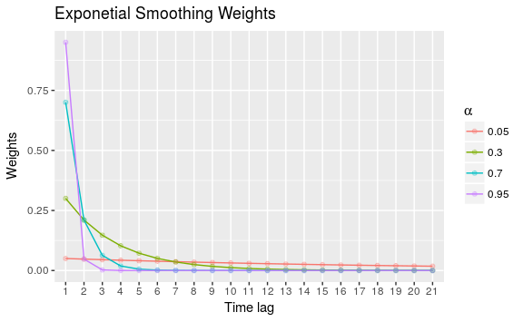
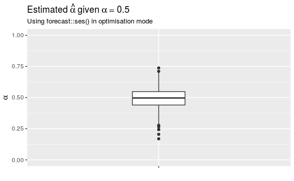
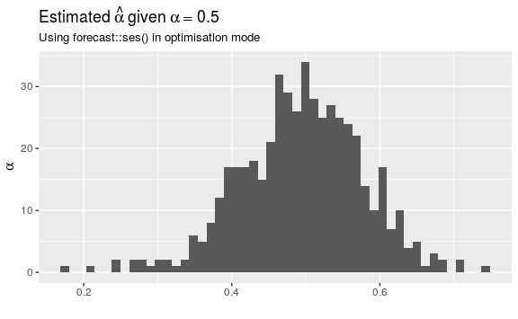

Exponential Smoothing
================

Objective
---------

Demonstrate of exponential smoothing.

### Simple Exponetial Smoothing

#### Principle

Forecasts are based on a weighted average of past results where the weights decrease exponentially as the observations are further in the past:

$$
 \\hat{y}\_{T + 1|T}=\\alpha y\_T + \\alpha (1 - \\alpha) y\_{T-1} + 
                                \\alpha (1 - \\alpha)^2 y\_{T-2} \\ldots
$$

For small *α*, lim<sub>*α* → 0</sub>(1 − *α*)=1 so the weights tend to *α* for all historical observations. For many samples, this is equivalent to the unweighted mean since *α* will sum to one. For *α* = 1, $\\hat{y}\_{T+1|T} = y\_T$. This is a so-called 'naive' forecast i.e. the forecast for the next result is simply the same as the current result. For intermediate values of *α*, the forecast is somewhere between a simple average of all data and a naive prediction.

The plot of weighting against time lag for various *α* depicts this:

``` r
grid <- data_frame(
   alpha = c(0.05, 0.3, 0.7, 0.95),
   t = rep(list(0:20))
)

grid <- grid %>% 
    mutate(
        weights = map2(.x = t, .y = alpha, ~.y * (1 - .y)^.x),
        alpha = as.factor(alpha)
    ) %>% 
    unnest() 

(g_smooth_weights <- ggplot(grid, aes(x = as.factor(t + 1), y = weights, 
                 group = alpha, col = alpha)) +
    geom_line() +
    geom_point(alpha = 0.3) +
    labs(
        title = "Exponetial Smoothing Weights",
        y = "Weights",
        x = "Time lag",
        colour = expression(alpha)
    ))
```



#### Simulation

Simple exponential smoothing (SES) applies to time series with no trend or seasonality. The r function `forecast::ses()` is used to estimate an SES model. For example, consider the simulation below.

``` r
# for reproducibility ---------------------------------------------------------
set.seed(20170214) 

# function to generate simulation ---------------------------------------------
ses_sim <- function(alpha = 0.5, N = 120, l_0 = 0) {
    
  # initiatialisation ---------------------------------------------------------
  y <- numeric(N)
  y_fcast <- numeric(N)
  error <- rnorm(N)
  y[1] <- l_0                
  y_fcast[1] <- l_0     # set l_0 to be equivalent to y_1
  
  # simulation
  for (i in seq_along(y)[-1]) {
      y_fcast[i] <- alpha * (y[i - 1]) + (1 - alpha) * y_fcast[i - 1] 
      y[i] <- y_fcast[i] + error[i]
  }
  
  ts(y, start = 2010, frequency = 12)
}

# forcast using SES -------------------------------------------------------
my_sim <- ses_sim(alpha = 0.5)
fcast_fix <- ses(my_sim, alpha = 0.5, initial = 'simple')
fcast_opt <- ses(my_sim, initial = 'simple')

cat(sprintf("Alpha: %1.2f", fcast_opt$model$par['alpha']))
#> Alpha: 0.58
```

A time series is generated which adheres to an SES model with *α* = 0.5. As is required for SES modelling, trend or seasonality has not been included. When `forecast::ses()` is invoked without setting alpha, an optimum is calculated by minimising SSE (sum of squared errors). The value estimated is 0.58. Of course, this the estimate is not *exactly* 0.5 since a random normal IDD error has been included in the simulation.

If the simulation is run many times, it is possible to gain an insight into the performance. Here, a check is performed that the estimated *α* from 500 simulations is centered on the actual *α* of 0.5.

``` r
set.seed(1024)
sim_df <- 
    data_frame(my_sim = replicate(500, list(ses_sim(0.5)))) %>% 
    mutate(
        my_mod = map(my_sim, ses, initial = 'simple'),
        alpha = map_dbl(my_mod, c('model', 'par', 'alpha'))
    )
```

The results are plotted here:

``` r
# remove alpha = 0 which are probably failed models ----------------------------
(g_sim_df_box <- sim_df %>% filter(alpha > 0) %>% 
    ggplot(aes(y = alpha, x = "alpha")) +
        geom_boxplot(width = 0.2) + 
        scale_y_continuous(limits = c(0, 1)) +
        labs(
            title = bquote(paste("Estimated", ~hat(alpha), ~
                                 "given", ~alpha == 0.5)),
            subtitle = "Using forecast::ses() in optimisation mode",
            x = "",
            y = quote(alpha)
        ) +
        theme(axis.text.x = element_blank()))

(g_sim_df_hist <- sim_df %>% filter(alpha > 0) %>% 
    ggplot(aes(x = alpha)) +
        geom_histogram(bins = 50) + 
        labs(
            title = bquote(paste("Estimated", ~hat(alpha), ~
                                 "given", ~alpha == 0.5)),
            subtitle = "Using forecast::ses() in optimisation mode",
            x = "",
            y = quote(alpha)
        ))
```



#### Forecasting

In R, a plot of the fit and forecast can be produced as follows. Here, the actual and estimated *α* are included.

``` r
# convert fitted line to data frame for ggplot ----------------------------
date <- fcast_fix$x %>% 
    as.xts() %>% 
    index()

ses_fitted <- data_frame(
    date,
    fit_05 = coredata(fcast_fix$fitted),
    fit_opt = coredata(fcast_opt$fitted)
) %>% gather(var, value, -date)

autoplot(fcast_fix) + 
    geom_line(data = ses_fitted, aes(x = date, y = value, colour = var))
```


Forecasts in the SES model are 'flat' and include no trend or seasonality. Hence, the forecast ahead is a flat line. Confidence intervals are included and as expected, these increase with the time to the forecast horizon.
