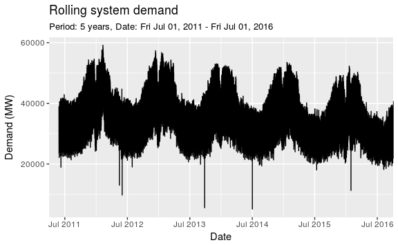
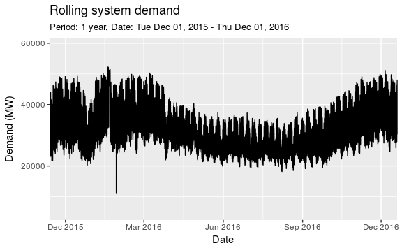
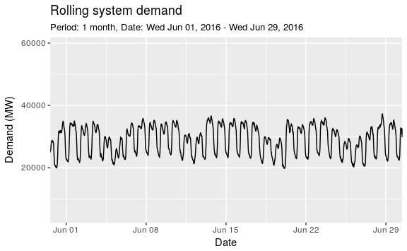
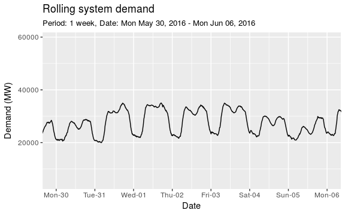
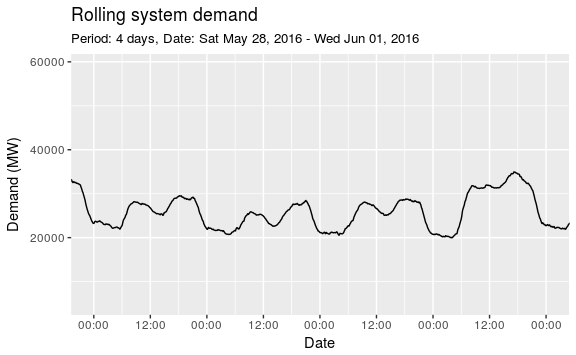
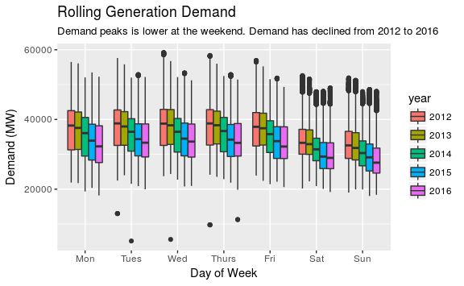
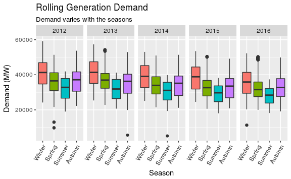
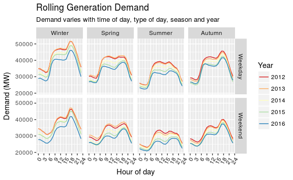

Rolling System Demand with Grid Watch Data
================
Nick P Taylor
2017-03-02

Read Data
---------

The [Elexon API](https://www.elexon.co.uk/wp-content/uploads/2016/10/Application-Programming-Interfaces-API-and-Data-Push-user-guide.pdf) (Ghanty 2016) gives access to time windows of data of restricted size. For rolling systems demand, this is of the order of 1 week. Collecting data covering several years would require querying the API in a loop. Since this may not be deemed acceptable by the provider, pooled data is downloaded from the [Grid Watch](http://www.gridwatch.templar.co.uk/download.php) website (Grid Watch 2017). The data is downloaded manually and then read with the following code:

``` r
demand_df <- read_csv('gridwatch.csv', 
    col_types = cols(
        id = col_integer(),
        timestamp = col_datetime(format = ""),
        demand = col_integer()
    )
)

(demand_df <- demand_df %>% 
    select(date_time = timestamp, demand, -id))
#> # A tibble: 602,074 × 2
#>              date_time demand
#>                 <dttm>  <int>
#> 1  2011-05-27 15:50:04  38874
#> 2  2011-05-27 15:55:02  38845
#> 3  2011-05-27 16:00:02  38745
#> 4  2011-05-27 16:05:01  38826
#> 5  2011-05-27 16:10:02  38865
#> 6  2011-05-27 16:15:01  38881
#> 7  2011-05-27 16:20:02  38876
#> 8  2011-05-27 16:25:04  38911
#> 9  2011-05-27 16:30:03  38829
#> 10 2011-05-27 16:35:01  38735
#> # ... with 602,064 more rows
```

This data will be referred to as GW (i.e. Grid Watch) data for brevity. The data time zone is UTC and this is **important**. It is convinient to keep all data in UTC unless we are presenting it to someone who is cross-referencing within a local time zone.

Regularising
------------

The `forecast` package (Hyndman 2017), which will be used later, assumes that the input data at regular intervals. The raw data does not adhere to this since:

1.  The GW data does not capture an observation *exactly* every 5 minutes; it is often a few seconds late (see raw data above).

2.  There are occasions when data is missing from the BM report.

The `xts` package (Ryan and Ulrich 2014) contains several functions for manipulating general time series. The code below follows these steps:

-   Make a time sequence that spans the timestamps in the raw data and has an interval of 5 minutes. Start from the first time recorded rounded to 5 minutes.

-   For each time interval in the regular sequence, look backwards in the downloaded GW data to find the value.

-   This approach means that the regularised times are actually 5 minutes ahead of the actual times. So substract 5 minutes from the timestamp.

Rather than 'look backwards', an approach of looking forward could have been taken which would have removed the need to subtract 5 minutes from the timestamp. However, that would have meant that if there were gaps in the BM report data, they would incorrectly be filled by looking forward to the first observation after the gap.

``` r
demand_xts <- xts(demand_df$demand, demand_df$date_time)
reg_time <- seq(from = ceiling_date(min(demand_df$date_time), "5 mins"), 
                to = max(demand_df$date_time), 
                by = "5 mins")

(demand_df <- demand_xts %>% 
    merge(reg_time, fill = na.locf) %>% 
    merge(reg_time, join = 'inner') %>% 
    broom::tidy() %>% 
    select(date_time = index, demand = value) %>% 
    mutate(date_time = date_time - minutes(5)) %>% 
    as_tibble())
#> # A tibble: 603,926 × 2
#>              date_time demand
#>                 <dttm>  <dbl>
#> 1  2011-05-27 15:50:00  38874
#> 2  2011-05-27 15:55:00  38845
#> 3  2011-05-27 16:00:00  38745
#> 4  2011-05-27 16:05:00  38826
#> 5  2011-05-27 16:10:00  38865
#> 6  2011-05-27 16:15:00  38881
#> 7  2011-05-27 16:20:00  38876
#> 8  2011-05-27 16:25:00  38911
#> 9  2011-05-27 16:30:00  38829
#> 10 2011-05-27 16:35:00  38735
#> # ... with 603,916 more rows
```

Compare the data above with the raw data; the data is now at regular intervals and is reflective of the actual data recorded by the BM reports as opposed to the time at which GW recorded the BM report data. Note that 'df' is appended to data frame class variable names, xts to 'xts' classes and later, 'ts' will be appended to 'time series' classes. This is to help keep track of variable classes.

Exploratory Analysis
--------------------

### Time window plots

Generation demand data has periodicity on various time scales. This can be visualised by plotting time windows of:

-   5 years
-   1 year
-   1 month
-   1 week
-   a few (4) days.

The `purrr` package (Wickham 2016) from the `tidyverse` (Wickham 2017b) is used to iterate through these time windows and plot the data in an efficient manor. The code below takes the following steps:

1.  Define a function which takes arguments of a data set, a time window, and some formatting customisation. The function and returns a plot and will be invoked several times. The `ggplot2` package (Wickham 2009), which is also part of the `tidyverse`, is used for the plot.

2.  Define a list of arguments to pass to the function. Each entry corresponds to the arguments required for an individual time windowed plot.

3.  Use the `purrr::pmap` is used to pass the list of arguments iteratively (i.e. in a loop) to the function defined in 1.

NB - This style of programming is more efficient and legible that the alternative of repeating code for each time window. It is also easier to maintain if changes are reqired in the future.

``` r
# graph plotting function ------------------------------------------------------
gg_rolsysdem <- function(df, breaks, form_str, period) {
    
    g <- ggplot(df, aes(x = date_time, y = demand)) +
        geom_line() +
        labs(title = "Rolling system demand",
             subtitle = sprintf("Period: %s, Date: %s - %s", 
                              period,
                              format(min(breaks), "%a %b %d, %Y"),
                              format(max(breaks), "%a %b %d, %Y")),
             x = "Date",
             y = "Demand (MW)") 
    
    if (!is.null(breaks)) {
        g <- g + 
          coord_cartesian(xlim = c(min(breaks), max(breaks))) +
          scale_x_datetime(breaks = breaks, date_labels = form_str)
    }
    g
}

# list of arguments ------------------------------------------------------------
my_breaks <- list(
    breaks = list(
        seq(ymd_h("2015-12-01 0"), by = "3 months", length.out = 5),
        seq(ymd_h("2016-06-01 0"), by = "1 week", length.out = 5),
        seq(ymd_h("2016-05-30 0"), by = "1 days", length.out = 8),
        seq(ymd_h("2016-05-28 0"), by = "12 hours", length.out = 9)
    ), 
    form_str = list(
        "%b %Y",
        "%b %d",
        "%a-%d",
        "%H:%M"
    ),
    period = list(
        "1 year",
        "1 month",
        "1 week",
        "4 days"
    )
)

# first plot all data ----------------------------------------------------------
gg_rolsysdem(demand_df %>% filter(between(demand, 5000, 60000)), 
             breaks = seq(ymd_h("2011-07-01 0"), by = "1 year", length.out = 6),
             form_str = "%b %Y",
             period = "5 years")

# now interate through time windows in list ------------------------------------
my_breaks %>% 
    pmap(gg_rolsysdem, demand_df %>% filter(between(demand, 5000, 60000)))
```



### Discussion of Time Window Plots

Seasonality in electricity generation is quite complex. It includes:

-   An annual seasonality i.e. demand varies according to cold/hot weather. As is clear from the 5 year plot, energy demand is lower in the summer than in the winter.

-   A weekly seasonality i.e. demand is dependent on the day of the week. This is most clearly shown in the 1 month plot. The weekend day pairs are visible; they are the ones with noticeably lower demand.

-   A daily seasonality i.e. demand depends on the time of the day. In the time windows that we focus on, the demand is at its lowest at around 6am and then sharply rises to peak at around 9. It then declines until about 3pm and then undergoes a second increase to peak at around 6pm. It plateaus until round 9pm when it begins to decline again.

### Variaton by Day of the Week and Year

First, some new variables are added to the data frame to categorise the `date_time` by the day of the week and the year. The `forcats` package (Wickham 2017a) is used to work with categorical data and the `lubridate` package (Grolemund and Wickham 2011) provides a range of functions for working with time based data. After categorising the data, the daily and yearly variation is visualised with a side-by-side box plot.

``` r
demand_df <- demand_df %>% 
    mutate(
        # categorise by day of week, make sure sunday is the 'last' day -------
        week_day = wday(date_time, label = TRUE), 
        week_day = fct_relevel(week_day, "Sun", after = Inf),
        # make year a factor (rather than an integer) -------------------------
        year = as.factor(year(date_time))) %>% 
    filter(between(demand, 5000, 60000))

# ------------------------------------------------------------------------------
# the years 2011 and 2017 are incomplete
# data will be biased unless they are removed
# ------------------------------------------------------------------------------
g_df <- demand_df %>% 
    filter(!(year %in% c(2011, 2017)))
    
ggplot(g_df, aes(x = week_day, y = demand, fill = year)) +
    geom_boxplot() +
    scale_fill_discrete() +
    labs(
        title = "Rolling Generation Demand",
        subtitle = paste("Demand peaks is lower at the weekend.",
                         "Demand has declined from 2012 to 2016"),
        x = "Day of Week",
        y = "Demand (MW)"
    )
```



Wheras the line plots above had a small time window, here, the entire data set is considered. The intuition and observation that the weekend days have a lower demand on average than the weekdays is supported. The other main observation here is that demand has been in decline between 2012 and 2016.

### Variation by Season and Year

Seasons are categorised by month in the code below. A new variable called `year_season` adjusts the year for December so that December, January and February are grouped as Winter 2012 i.e. December 2011 is grouped is reallocated to 2012 so as to group with the succeeding winter months. The box plot coded next visualises variation by season and the adjusted year i.e. `year_season`.

``` r
demand_df <- demand_df %>% 
    mutate(
        month = month(date_time, label = TRUE),
        # categorise by season ------------------------------------------------ 
        season = fct_recode(month,
            "Winter" = "Dec",
            "Winter" = "Jan",
            "Winter" = "Feb",
            "Spring" = "Mar",
            "Spring" = "Apr",
            "Spring" = "May",
            "Summer" = "Jun",
            "Summer" = "Jul",
            "Summer" = "Aug",
            "Autumn" = "Sep",
            "Autumn" = "Oct",
            "Autumn" = "Nov"
        ),
        # associate December with winter of following year ---------------------
        year_season = 
            as.factor(if_else(
                month == "Dec", year(date_time) + 1, year(date_time))))

# ------------------------------------------------------------------------------
# the years 2011 and 2017 are incomplete
# data will be biased unless they are removed
# ------------------------------------------------------------------------------
g_df <- demand_df %>%     
    filter(!(year_season %in% c(2011, 2017)))
    
ggplot(g_df, aes(x = season, y = demand, fill = season)) +
    geom_boxplot(show.legend = FALSE) + 
    facet_grid(. ~ year_season) +
    theme(axis.text.x = 
          element_text(angle = 60, vjust = 1, hjust = 1)) +
    labs(
        title = "Rolling Generation Demand",
        subtitle = paste("Demand varies with the seasons"),
        x = "Season",
        y = "Demand (MW)"
    )
```



The boxplot supports the intution and observation in the line plots above that there is a significant difference in the level of demand with the seasons and that there is a downward trend of demand from 2012-2017. A more rigorous statistical test could later be applied to provide futher evidence of the seasonal difference and existance of the trend. The anlayis being performed currently is referred to as Exploratory Data Anlayis (EDA). This typically involves plotting data to seek patterns for further rigorous study later.

### Variation by Week Day or Weekend, Season and Year

The next plot captures how demand varies with several variables.

``` r
# categorise days by weekday or weekend ----------------------------------------
demand_df <- demand_df %>% 
    mutate(is_weekend = if_else(week_day %in% c("Sat", "Sun"), TRUE, FALSE))

# ------------------------------------------------------------------------------
# the years 2011 and 2017 are incomplete
# data will be biased unless they are removed
# ------------------------------------------------------------------------------
g_df <- demand_df %>%     
    filter(!(year_season %in% c(2011, 2017)))

# custom labelling for plot ----------------------------------------------------
facet_labels <- c("TRUE" = "Weekend", "FALSE" = "Weekday") 

ggplot(g_df, aes(x = hour(date_time), y = demand, colour = year_season)) +
    stat_summary(fun.y = "mean", geom = "line") + 
    facet_grid(is_weekend ~ season, 
               labeller = labeller(is_weekend = facet_labels)) +
    theme(axis.text.x = 
          element_text(angle = 60, vjust = 1, hjust = 1)) +
    scale_colour_brewer(palette = "Spectral") +
    scale_x_continuous(breaks = seq(0, 24, by = 3)) +
    scale_y_continuous(breaks = 2:6 * 10000) +
    labs(
        title = "Rolling Generation Demand",
        subtitle = paste("Demand varies with time of day, type of day,", 
                         "season and year"),
        x = "Hour of day",
        y = "Demand (MW)",
        colour = "Year"
    )
```



In the above plot, the line plots represent the mean of the generation grouped by hour of day, whether the day is a weekend or weekday, the season and the year. All of the intuitions and observations previously discussed are supported.

In addition, the plots reveal something not seen above: the hourly profile may be dependent on the the season. For example, the strong demand peak at 1800 is much more pronounced in winter, less so in autumn/spring and weak in summer. Although the level of the demand profile reduces at the weekend, the shape seems to be the same for weekdays and weekends. Intuitively, this is therefore likely to be a feature of domestic activity, for example, heating usage and lighting. For eample, it may suggest that people fix the time for heating to swich on to be same for the week and the weekend.

<!---


```r
#demand_2016_reg_ts <- ts(demand_2016_reg_df$demand, frequency = 12 * 24)
```


```r
#seas_adj <- ma(ma(demand_2016_reg_ts, order = 12 * 24), order = 7 * 12 * 24)
#demand_2016_reg_df <- demand_2016_reg_df %>% 
#    mutate(seas_adj = coredata(seas_adj)) %>% 
#    gather(var, value, -date_time, na.rm = TRUE)

#ggplot(demand_2016_reg_df, aes(x = date_time, y = value, colour = var)) + geom_line() +
#    coord_cartesian(xlim = 
#                    c(ymd_hms("2016-01-01 00:00:00", "2016-04-01 00:00:00"))) +
#    scale_colour_manual(labels = c("Raw", "Adjusted") + 
#    labs(
#        title = "Rolling system demand",
#        subtitle = "Applying simple moving average to de-season",
#        caption = "Data from https://api.bmreports",
#        colour = "Demand", 
#        x = "Time",
#        y = "Demand (MW)"
#    ) 
```


```r
#ggplot(demand_2016, aes(x = date_time, y = demand)) +
#    geom_line() +
#    labs(
#        title = "Rolling system demand for 2016",
#        caption = "Data from https://api.bmreports",
#        x = "Time",
#        y = "Demand (MW)"
#    )
```
##  Regularise 


## Seasonality seasonality

The data is 'spiky' because of the daily cycle of electricity usage.  Intuitively, the UK as a whole uses less electricity at night, industrial usage then ramps up during the day and domestic usage in the evening.  If we have an interest in the trend of demand over many days, it can be useful for remove the seasonality.  

The daily seasonality can be removed by selecting an appropriate moving average [@hyndman_2014mm, sec. 6.2].  In this case, the data is collected


```r
rm(my_api_key)
#> Warning in rm(my_api_key): object 'my_api_key' not found
```


```r
#ggplot(demand_2016, aes(x = date_time, y = demand)) +
#    geom_line() +
#    labs(
#        title = "Rolling system demand for 2016",
#        caption = "Data from https://api.bmreports",
#        x = "Time",
#        y = "Demand (MW)"
#    )
```
##  Regularise 


## Seasonality seasonality

The data is 'spiky' because of the daily cycle of electricity usage.  Intuitively, the UK as a whole uses less electricity at night, industrial usage then ramps up during the day and domestic usage in the evening.  If we have an interest in the trend of demand over many days, it can be useful for remove the seasonality.  

The daily seasonality can be removed by selecting an appropriate moving average [@hyndman_2014mm, sec. 6.2].  In this case, the data is collected


--->
References
----------

Ghanty, Zaahir. 2016. *BMRS API and Data Push User Guide*. Elexon. <https://www.elexon.co.uk/wp-content/uploads/2016/10/Application-Programming-Interfaces-API-and-Data-Push-user-guide.pdf>.

Grid Watch. 2017. “Download.” <http://www.gridwatch.templar.co.uk/index.php>.

Grolemund, Garrett., and Hadley Wickham. 2011. “Dates and Times Made Easy with Lubridate.” *Journal of Statistical Software* 40 (3): 1–25. <http://www.jstatsoft.org/v40/i03/>.

Hyndman, Rob J. 2017. *forecast: Forecasting Functions for Time Series and Linear Models*. <http://github.com/robjhyndman/forecast>.

Ryan, Jeffrey A., and Joshua M. Ulrich. 2014. *xts: eXtensible Time Series*. <https://CRAN.R-project.org/package=xts>.

Wickham, Hadley. 2009. *ggplot2: Elegant Graphics for Data Analysis*. Springer-Verlag New York. <http://ggplot2.org>.

———. 2016. *purrr: Functional Programming Tools*. <https://CRAN.R-project.org/package=purrr>.

———. 2017a. *forcats: Tools for Working with Categorical Variables (Factors)*. <https://CRAN.R-project.org/package=forcats>.

———. 2017b. *tidyverse: Easily Install and Load ’Tidyverse’ Packages*. <https://CRAN.R-project.org/package=tidyverse>.
