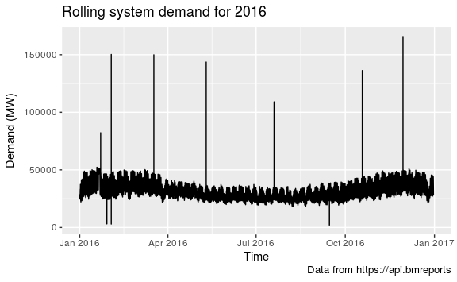
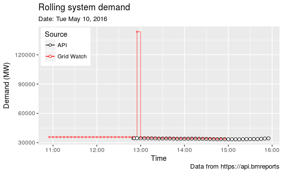
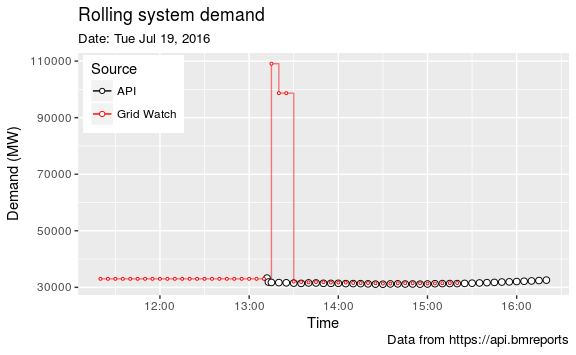

Rolling System Demand
================
Nick P Taylor

API Request
-----------

The following code block defines a function for accessing 'rolling system demand' data from the BM reports API.

``` r
get_rolsysdem <- function(start_datetime, end_datetime, api_key = NULL) {

    stopifnot(all(is.POSIXct(c(start_datetime, end_datetime))))

    # get API key from user  ---------------------------------------------------
    if (is.null(api_key)) {
        api_key <- getPass("Enter API key")
    }
    stopifnot(!is.null(api_key))

    # API query data
    report_type <- "BMRS/ROLSYSDEM"         # name of report to request from API

    # construct query API URL --------------------------------------------------
    service_url <- paste(
        "https://api.bmreports.com:443",
        report_type,
        "v1",
        sep = "/")

    query_url <- service_url %>%
        param_set("APIKey", api_key) %>%
        param_set("FromDateTime",
                  url_encode(format(start_datetime, "%F %T"))) %>%
        param_set("ToDateTime",
                  url_encode(format(end_datetime, "%F %T"))) %>%
        param_set("ServiceType", "xml")

    # connect to API and request data -----------------------------------------
    print(paste0("[", Sys.time(), "] Connected to BM Reports API ..."))
    xmlfile <- read_xml(query_url)

    # tidy up sensitive information -------------------------------------------
    rm(api_key,  query_url)

    # extract raw data from XML document and save -----------------------------
    data_xpaths <- list(
        date = "//settDate",
        time = "//publishingPeriodCommencingTime",
        demand = "//fuelTypeGeneration"
    )

    # parse XML and tidy -------------------------------------------------------
    pmap(list(xpath = data_xpaths), xml_find_all, x = xmlfile) %>%
        map_df(xml_text) %>%
        mutate(
               date_time = with_tz(ymd_hms(paste(date, time)), 'Europe/London'),
               demand = as.numeric(demand)) %>%
        select(date_time, demand, -c(date, time))

}
```

Example API request
-------------------

Here is a request for 1 week of data, commencing 2nd February, 2017:

``` r
my_start <- ymd_hms("2017-02-06 00:00:00", tz = 'Europe/London')
my_end <- my_start + dweeks(1)
```

``` r
# get API key from user  ---------------------------------------------------
my_api_key <- getPass("Enter API key")
demand_api <- get_rolsysdem(my_start, my_end, my_api_key)
#> [1] "[2017-02-23 09:57:57] Connected to BM Reports API ..."
saveRDS(demand_api, 'demand_api.rds')
```

The data is saved to mitigate repeated access to the API.

Plot Data
---------

Here is the week of data.

``` r
demand_api <- readRDS('demand_api.rds')

my_breaks <- seq(from = my_start, my_end, by = '6 hours')

g_api <- ggplot(demand_api, aes(x = date_time, y = demand)) +
    geom_line(colour = 'red') +
    labs(
        title = "Characteristic 'seasonality' of rolling system demand",
        subtitle = "Seasonality has a period of 24 hours",
        caption = "Data from https://api.bmreports",
        x = "Time",
        y = "Demand (MW)"
    ) +
    scale_x_datetime(date_breaks = "1 day", minor_breaks = my_breaks,
                     labels = date_format("%d-%b-%y"))
g_api
```


As expected, clear daily seasonality is observed.

Grid Watch Data
---------------

I am interested in studying the national grid demand over a period of several years. I discovered that the demand data accessed above is limited to requests of 2000 rows. This is a total of 1 week. Rather than use the API in a loop to get many weeks data and potentially getting blocked, I have decided to download a flat file from [Gridwatch](http://www.gridwatch.templar.co.uk/). This is done manually which is not ideal. It is claimed that this data is collected from the BM reports so should be the same data. Before using this data, a consistency check against the API data direct from the BM reports will be of interest.

### Read Grid Watch Data

The CSV file is read and tidied as follows:

``` r
demand_gw <- read_csv('gridwatch.csv',
    col_types = cols(
        id = col_integer(),
        timestamp = col_datetime(format = ""),
        demand = col_integer()
    )
)

demand_gw <- demand_gw %>%
    mutate(date_time = with_tz(timestamp, tzone = 'Europe/London')) %>%
    mutate(date_time = floor_date(date_time, "5 mins")) %>%
    select(date_time, demand, -c(id, timestamp)) %>%
    arrange(date_time)

saveRDS(demand_gw, "demand_gw.rds")
```

Note that this is rounded to 5 minutes since this is the inverval at which BM reports occur. The discrepancy in time is likely due to time it takes to collect the data from the BM report server.

There is a fair bit of data here. The first date in the data is 2011-05-27 and the final date is 2017-02-21 i.e. the final date is when I downloaded the data. The data should be captured at apporoximately 5 mins intervals. This is a quick santity check of this fact.

``` r
demand_gw <- readRDS('demand_gw.rds')

no_mins <- demand_gw$date_time %>%
    range() %>%
    diff() %>%
    as.duration() %>%
    as.numeric("minutes")

# expect reading every 5 mins --------------------------------------------------
sprintf("Expected number rows: %i", no_mins/5)
#> [1] "Expected number rows: 603926"
sprintf("Actual number of rows: %i", nrow(demand_gw))
#> [1] "Actual number of rows: 602074"

# what is happening ------------------------------------------------------------
diff_check <- demand_gw %>%
    mutate(interval = as.numeric(date_time - lag(date_time))) %>%
    drop_na() %>%
    mutate(interval = cut(interval, breaks = c(-Inf, seq(260, 340, 5), Inf)))

g_diff_check <- ggplot(diff_check, aes(x = interval)) +
    geom_bar() +
    theme(axis.text.x = element_text(angle = 90)) +
    labs(
        title = "Distribution of intervals",
        subtitle = "Centered at 300s (5 mins) with significant outliers",
        x = "Interval (s)",
        y = "Count"
    )
g_diff_check
```


Upon inspection of the data, at first sight, there appears to be nothing out of the ordinary other than the fact that sometimes, observations are quite regular and centered around 300 seconds. However, there are exceptions.

The integrity of the data against the API data visually:

``` r
# filter 2016 demand -----------------------------------------------------------
my_start <- ymd_hms("2017-02-06 00:00:00", tz = 'Europe/London')
my_end <- my_start + dweeks(1)

demand_feb <- demand_gw %>%
    filter(between(date_time, my_start, my_end))

g_check_level <- g_api +
    geom_line(data = demand_feb, aes(x = date_time, y = demand),
              col = 'green', lty = 'dashed')
g_check_level
```


Now, a thorogh check of the grid watch data against the API data will be performed. Consider the data for 2016 which is plotted here:

``` r
my_start <- ymd_hms("2016-01-01 00:00:00", tz = 'Europe/London')
my_end <- my_start + dyears(1)

demand_2016 <- demand_gw %>%
    filter(between(date_time, my_start, my_end))

g_gw_dem_2016 <- ggplot(demand_2016, aes(x = date_time, y = demand)) +
    geom_line() +
    labs(
        title = "Rolling system demand for 2016",
        caption = "Data from https://api.bmreports",
        x = "Time",
        y = "Demand (MW)"
    )
g_gw_dem_2016
```



There are some 'spikes' which require some investigation. A starting point could be to directly request the data through the API at these times and compare it to spikes recorded in the grid watch summarised data. First, demand greater than 60GW or less than 5GW, are filtered. By observervation, this filter should caputure the 10 obvious spikes.

``` r
# filter results that have greater than 60000 MW demand ------------------------
spikes <- demand_2016 %>%
    filter(demand > 60000 | demand < 5000) %>%
    mutate(year_day = yday(date_time))
spikes
#> # A tibble: 49 × 3
#>              date_time demand year_day
#>                 <dttm>  <int>    <dbl>
#> 1  2016-01-22 14:25:00  82251       22
#> 2  2016-01-28 22:40:00   3343       28
#> 3  2016-01-28 22:45:00   3368       28
#> 4  2016-01-28 22:50:00   3393       28
#> 5  2016-01-28 22:55:00   3418       28
#> 6  2016-01-28 23:00:00   3443       28
#> 7  2016-01-28 23:05:00   3464       28
#> 8  2016-01-28 23:10:00   3295       28
#> 9  2016-01-28 23:15:00   3091       28
#> 10 2016-01-28 23:20:00   3091       28
#> # ... with 39 more rows
```

It is apparent that spikes sometimes occur consecutively. These shall be grouped and then a 4 hour window centered on the spikes will be computed.

``` r
spikes <- spikes %>%
    group_by(year_day) %>%
    summarise(mean_time = floor_date(mean(date_time), "5 min")) %>%
    mutate(start_time = mean_time - hours(2),
           end_time = mean_time + hours(2))
spikes
#> # A tibble: 10 × 4
#>    year_day           mean_time          start_time            end_time
#>       <dbl>              <dttm>              <dttm>              <dttm>
#> 1        22 2016-01-22 14:25:00 2016-01-22 12:25:00 2016-01-22 16:25:00
#> 2        28 2016-01-28 23:15:00 2016-01-28 21:15:00 2016-01-29 01:15:00
#> 3        29 2016-01-29 00:05:00 2016-01-28 22:05:00 2016-01-29 02:05:00
#> 4        33 2016-02-02 12:30:00 2016-02-02 10:30:00 2016-02-02 14:30:00
#> 5        77 2016-03-17 11:45:00 2016-03-17 09:45:00 2016-03-17 13:45:00
#> 6       131 2016-05-10 12:55:00 2016-05-10 10:55:00 2016-05-10 14:55:00
#> 7       201 2016-07-19 13:20:00 2016-07-19 11:20:00 2016-07-19 15:20:00
#> 8       258 2016-09-14 15:45:00 2016-09-14 13:45:00 2016-09-14 17:45:00
#> 9       292 2016-10-18 13:05:00 2016-10-18 11:05:00 2016-10-18 15:05:00
#> 10      334 2016-11-29 12:35:00 2016-11-29 10:35:00 2016-11-29 14:35:00
```

There are 10 rows of data so it is confirmed that 10 spikes are captured within the windows. Next, the API will be invoked given the spike start and end 4 hour slots. Here, the `purrr` package is used which faciliates iterative use of functions. The result will be stored as a 'nested' data frame i.e. a column of data frames within a data frame.

``` r
spikes <- spikes %>%
    mutate(demand_api = map2(start_time, end_time, get_rolsysdem, my_api_key))
#> [1] "[2017-02-23 09:58:06] Connected to BM Reports API ..."
#> [1] "[2017-02-23 09:58:07] Connected to BM Reports API ..."
#> [1] "[2017-02-23 09:58:07] Connected to BM Reports API ..."
#> [1] "[2017-02-23 09:58:08] Connected to BM Reports API ..."
#> [1] "[2017-02-23 09:58:08] Connected to BM Reports API ..."
#> [1] "[2017-02-23 09:58:09] Connected to BM Reports API ..."
#> [1] "[2017-02-23 09:58:09] Connected to BM Reports API ..."
#> [1] "[2017-02-23 09:58:10] Connected to BM Reports API ..."
#> [1] "[2017-02-23 09:58:10] Connected to BM Reports API ..."
#> [1] "[2017-02-23 09:58:11] Connected to BM Reports API ..."
```

A similar process can be performed for the grid watch data. A filter function is created first to enhance readability of code. Then the function is iterated:

``` r
gw_filter <- function(x, y) {
    demand_gw %>% filter(between(date_time, x, y))
}

spikes <- spikes %>%
    mutate(demand_gw = map2(start_time, end_time, gw_filter))
```

It is desirable to merge the API and grid watch data sets for each time window. Since the times at which values are recorded in the two data sets are not synchronised, the `xts` package will be used to handle this:

``` r
merge_demand <- function(df_api, df_gw) {
    xts_api <- xts(df_api$demand, df_api$date_time)
    colnames(xts_api) <- "api"
    xts_gw <- xts(df_gw$demand, df_gw$date_time)
    colnames(xts_gw) <- "gw"

    cbind(xts_api, xts_gw) %>%
        broom::tidy() %>%
        drop_na() %>%
        rename(date_time = index, source = series, demand = value) %>%
        as_tibble()
}

spikes <- spikes %>%
    mutate(demand = map2(demand_api, demand_gw, merge_demand)) %>%
    select(-c(demand_gw, demand_api, mean_time))

saveRDS(spikes, "spikes.rds")
```

Each spike time window can now be plotted so that the grid watch and API data can be compared.

``` r
spike_plot <- function(df) {
    ggplot(df, aes(x = date_time, y = demand, colour = source)) +
        geom_step(aes(alpha = source)) +
        scale_color_manual(
            values = c('black', 'red'),
            labels = c("API", "Grid Watch")) +
        scale_alpha_manual(values = c(1, 0.5), guide = FALSE) +
        geom_point(aes(size = source, fill = source),
                   shape = 21, fill = 'white') +
        scale_fill_manual(values = c('white', 'red'), guide = FALSE) +
        scale_size_manual(values = c(2, .7), guide = FALSE) +
        labs(
            title = "Rolling system demand",
            subtitle = paste("Date:",
                             format(df[1, 'date_time'], "%a %b %e, %Y")),
            caption = "Data from https://api.bmreports",
            colour = "Source",
            x = "Time",
            y = "Demand (MW)"
        ) +
        theme(legend.justification = c(0, 1),
              legend.position = c(0.01, 0.99))
}

spikes$demand %>% map(spike_plot)
#> [[1]]
```


    #> 
    #> [[2]]


    #> 
    #> [[3]]


    #> 
    #> [[4]]


    #> 
    #> [[5]]


    #> 
    #> [[6]]



    #> 
    #> [[7]]



    #> 
    #> [[8]]


    #> 
    #> [[9]]


    #> 
    #> [[10]]


The following observations are made:

-   Spikes are windowed in plots 1, 4, 5, 6, 7, 9, 10. Dips are windowed in plots 2, 3, 4, 8. Note that 2 and 3 are the same incident. It is reported twice since the start and finish spans midnight.

-   Many of the data points bewteen the API and grid watch are alinged; but not all. It is difficult to comment on why this discrepancy occurs without digging into detail on how grid watch collects the API data.

-   All spike incidents reported in grid watch are spurious as the direct results from the API do not exhibit such spikes. Interestingly, every spurious spike is preceded by a period during which the API does not report data from several 5 minute periods.

-   Aside from the dip exhibited in the grid watch data in 4, the others appear to align with dips reported by the API. Each of these dips include 0MW demand. In my view, it is safe to assume that this is spurious.

My approach will be to remove the spikes and dips in the grid watch data based on the evidence above.

``` r
demand_2016 <- demand_2016  %>%
    filter(demand < 60000 & demand > 5000)
```

Regularising the time series
----------------------------

The forecasting functions in the `forecast` package assume that the data is observed at regular intervals. Currently, the data does not adhere to this since there are missing records. Here, the `xts` package is used to apply 'last observation carried forward' join with a regular time series. Note that most of this code relates to conversions between data frames and time series.

``` r
demand_2016_xts <- xts(demand_2016$demand, with_tz(demand_2016$date_time, 'UTC'))
reg_time <- seq(my_start, my_end, by = "5 mins")

demand_2016_reg_df <- demand_2016_xts %>%
    merge(reg_time, fill = na.locf) %>%
    merge(reg_time, join = 'inner') %>%
    broom::tidy() %>%
    mutate(date_time = with_tz(index, 'Europe/London')) %>%
    select(date_time, demand = value) %>%
    as_tibble()
```

A quick sanity check

``` r
ggplot(demand_2016, aes(x = date_time, y = demand)) +
    geom_line(size = 0.5) +
    geom_line(data = demand_2016_reg_df, aes(x = date_time, y = demand),
              col = 'red', linetype = 'dashed') +
    coord_cartesian(xlim =
                    c(ymd_hms("2016-06-01 00:00:00", "2016-07-01 00:00:00")))
```


We must select the unit of the time series and to begin with, we shall choose one day as the unit.

``` r
demand_2016_reg_ts <- ts(demand_2016_reg_df$demand, frequency = 12 * 24)
```

``` r
seas_adj <- ma(ma(demand_2016_reg_ts, order = 12 * 24), order = 7 * 12 * 24)
demand_2016_reg_df <- demand_2016_reg_df %>%
    mutate(seas_adj = coredata(seas_adj)) %>%
    gather(var, value, -date_time, na.rm = TRUE)
```

``` r
ggplot(demand_2016_reg_df, aes(x = date_time, y = value, colour = var)) +
    geom_line() +
    coord_cartesian(
        xlim = c(ymd_hms("2016-01-01 00:00:00", "2016-04-01 00:00:00")),
        ylim = c(0, 50000)) +
    labs(
        title = "Rolling system demand",
        subtitle = "Applying simple moving average to de-season",
        caption = "Data from https://api.bmreports",
        colour = "Demand",
        x = "Time",
        y = "Demand (MW)"
    ) +
    theme(legend.justification = c(1, 0), legend.position = c(0.99, 0.01))
```


The following observations are made:

-   Spikes are windowed in plots 1, 4, 5, 6, 7, 9, 10. Dips are windowed in plots 2, 3, 4, 8. Note that 2 and 3 are the same incident. It is reported twice since the start and finish spans midnight.

-   Many of the data points bewteen the API and grid watch are alinged; but not all. It is difficult to comment on why this discrepancy occurs without digging into detail on how grid watch collects the API data.

-   All spike incidents reported in grid watch are spurious as the direct results from the API do not exhibit such spikes. Interestingly, every spurious spike is preceded by a period during which the API does not report data from several 5 minute periods.

-   Aside from the dip exhibited in the grid watch data in 4, the others appear to align with dips reported by the API. Each of these dips include 0MW demand. In my view, it is safe to assume that this is spurious.

My approach will be to remove the spikes and dips in the grid watch data based on the evidence above.

``` r
rm(my_api_key)
```
